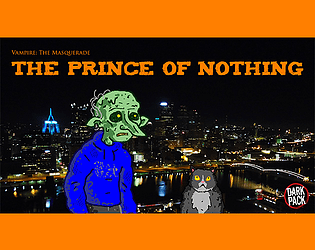

# About Me
I’m a data scientist working in Media Mix Modeling. I have degrees in Mathematics and Economics, and I am pursuing a Master's in Computer Science with a concentration in Machine Learning at Georgia Tech. I currently have a 4.0 GPA.

# My Projects
I co-created a [videogame about being a vampire in Pittsburgh](https://itch.io/jam/vtm/rate/1298082){:target="_blank" rel="noopener"}
{:target="_blank" rel="noopener"}

# News about me
Febuary 2022: published a videogame on https://itch.io/jam/vtm/rate/1298082
Fall 2020: I won the Pitt 2020 Hackathon's "Machine Learning / Big Data" Category with an epilepsy prediction algorithm!

Here's my [medium post on predicting Starbucks consumer behavior](https://medium.com/@AmishWarlord/predicting-starbucks-customer-behavior-119fc3a43480){:target="_blank" rel="noopener"}
{:target="_blank" rel="noopener"}

<h2> Random fun stuff </h2>

[My RSS feed](./RSS.html)
{:target="_blank" rel="noopener"}

[Here's my World of Darkness custom character generator](./vampire_creator.html)
{:target="_blank" rel="noopener"}

# Contact info
email: charlesmfry@gmail.com

